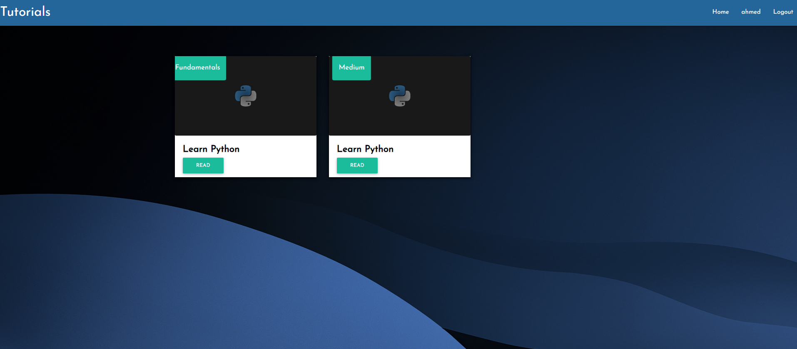

# Django Blog

This project is a simple blog application built using the [Django](https://www.djangoproject.com/) web framework. It allows users to create, edit, and publish posts, as well as add comments to posts.

### Prerequisites

To run this project, you will need the following:

* Python 3.5 or later
* Django 3.1 or later

If you don't have Python and Django installed, you can download and install them from the official Python and Django websites (https://www.python.org/ and https://www.djangoproject.com/ respectively).

### Installing

To install the project, follow these steps:

1. Clone the repository to your local machine using `git clone https://github.com/ahmedjasarevic/Blog-with-Django-Python.git`.
2. Run the development server using `python manage.py runserver`. This will start the server at http://127.0.0.1:8000/.

## Using the application

To use the blog application, follow these steps:

1. Open a web browser and navigate to http://127.0.0.1:8000/. This will take you to the home page of the blog.

2. To create a new post, you have to navigate to http://127.0.0.1:8000/admin. There you can add new post at section called "Tutorials".

3. Enter the title and content of your post in the respective fields, and then click on the "Publish" button. This will create your post.

4. You can match your post with series and categories.

5. You can make your account with register. If you already got account, you can login. If you click on your name, it will redirect you to your profile page with details info.
## Built With

* [Django](https://www.djangoproject.com/) - The web framework used

## Homepage of Blog

